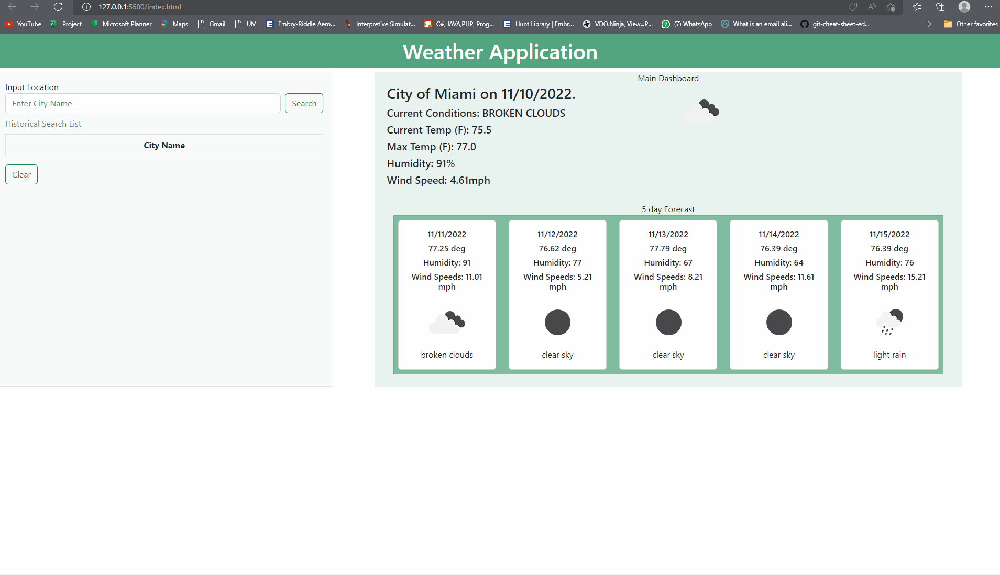

# WeatherDashboard
Displays the weather
# WeatherDashboard

### Description
Weather Dashboard
GIVEN a weather dashboard with form inputs
WHEN I search for a city
THEN I am presented with current and future conditions for that city and that city is added to the search history
WHEN I view current weather conditions for that city
THEN I am presented with the city name, the date, an icon representation of weather conditions, the temperature, the humidity, and the the wind speed
WHEN I view future weather conditions for that city
THEN I am presented with a 5-day forecast that displays the date, an icon representation of weather conditions, the temperature, the wind speed, and the humidity
WHEN I click on a city in the search history
THEN I am again presented with current and future conditions for that city

 

## How to use.

Upon Load the Home Page will load Miami Local Weather.

Open the webpage and the local storage will be utilized with input data.

Input the City Name world wide.

Click Search.

Click on any name in the history search and the website will run the search again.

Clear the history search by using the clear button.

 

#Link 

[Weather Dashboard](https://bulkacity.github.io/WeatherDashboard/)

 
### WebPage

 

## Technologies

* [HTML5](https://developer.mozilla.org/en-US/docs/Web/Guide/HTML/HTML5)
* [CSS](https://developer.mozilla.org/en-US/docs/Web/CSS)
* [Javascript](https://developer.mozilla.org/en-US/docs/Web/JavaScript)
* [jQuery](https://jquery.com/)
* [Font Awesome](https://fontawesome.com/)
* [Bootstrap](https://getbootstrap.com/)
* [Google Fonts](https://fonts.google.com/)
